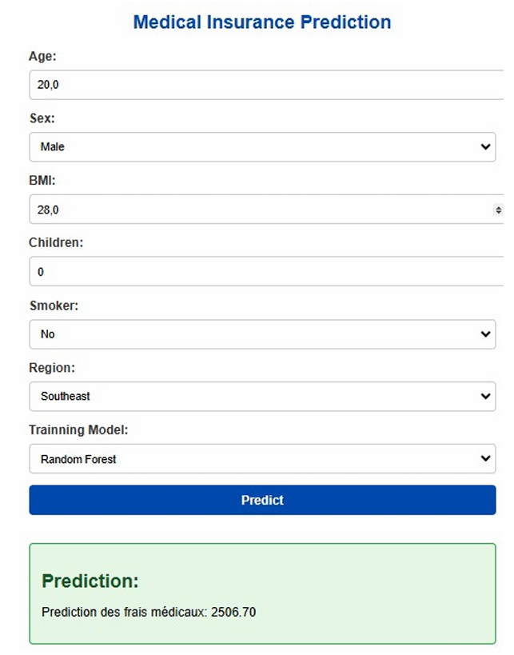

# 🏥 Health Insurance Cost Prediction

## 📖 Project Overview
This project is a **Health Insurance Cost Prediction Web App** built with **Flask** and powered by **Machine Learning models**.  
It allows users to input personal and lifestyle data such as **age, BMI, smoking habits, region, and number of children** to predict expected medical expenses.

The application integrates multiple models:
- 🌳 **Random Forest Regressor**
- 📈 **Linear Regression**
- ⚡ **Hybrid Model** (average of Random Forest & Linear Regression)

Additionally, this project is supported by a **research paper** that explores predictive modeling of healthcare costs, discussing the impact of demographic and lifestyle factors on medical charges.

[research paper (.pdf)](researchpaper.pdf)

---

## ⚙️ Features
- User-friendly **web interface** built with Flask.
- Choose between **Random Forest, Linear Regression, or Hybrid Model**.
- Real-time prediction of **medical insurance costs**.
- Encodes categorical features (sex, smoker, region) automatically.
- Research-backed methodology and evaluation.

---

## 👩‍💻 Author  

**Rania Alayachi**  
📧 alayachi.rania23@gmail.com  
🔗 [LinkedIn Profile](https://www.linkedin.com/in/rania-al-ayachi/)  
